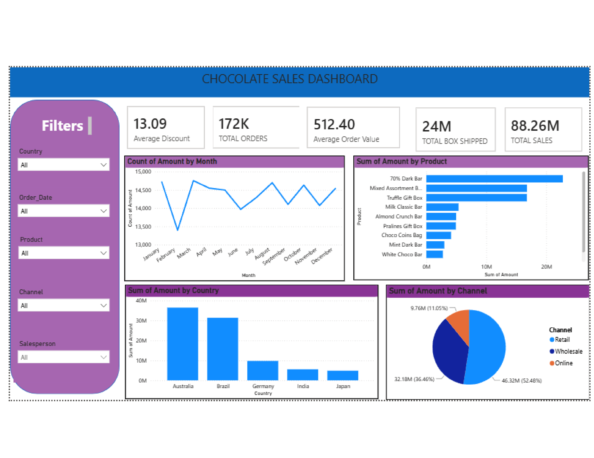

#  Chocolate Sales Analysis | Power BI Project

##  Project Overview

This project analyzes chocolate sales data using Microsoft Power BI. The dashboard provides insights into sales performance, customer trends, product performance, and regional sales to support business decision-making.

---

##  Dataset

* **Dataset Name:** Chocolate Sales
* **Tool Used:** Microsoft Power BI
* **Data Source:** Excel Dataset

---

## Tools & Technologies

* Microsoft Power BI
* Power Query
* DAX
* Microsoft Excel
  
##  Data Cleaning

The dataset was cleaned using Power Query Editor.

* Checked and corrected data types
* Removed duplicate records
* Trimmed extra spaces from text columns
* Cleaned text values
* Verified missing values
* Formatted the Date column
* Loaded the cleaned data into Power BI

---

##  Dashboard Features

* KPI Cards

  * Total Sales
  * Total Orders
  * Total Customers
  * Total Boxes Shipped

* Interactive Visuals

  * Sales Trend Over Time
  * Sales by Country
  * Sales by Product
  * sales by channel
    

* Interactive Slicers

  * Date
  * Country
  * Product
  * Salesperson

---

##  Key Insights

* Identified top-performing products.
* Compared sales across different countries.
* Analyzed monthly sales trends.
* Evaluated salesperson performance.
* Monitored customer and order distribution.

---

##  Dashboard Preview

---

##  Conclusion

This project demonstrates data cleaning, data transformation, interactive dashboard design, and business insight generation using Microsoft Power BI. It highlights practical skills in data visualization and business analytics.
